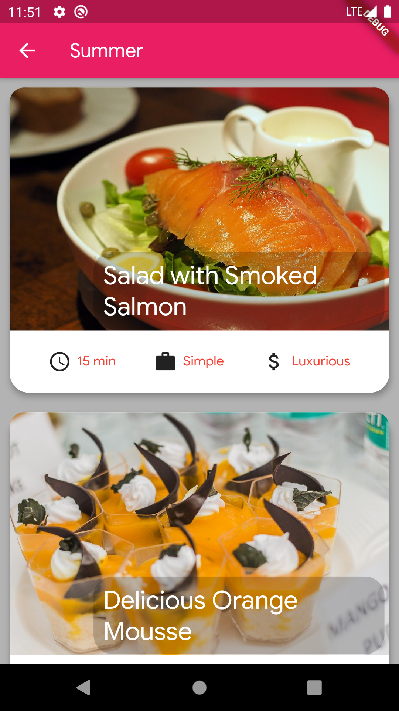
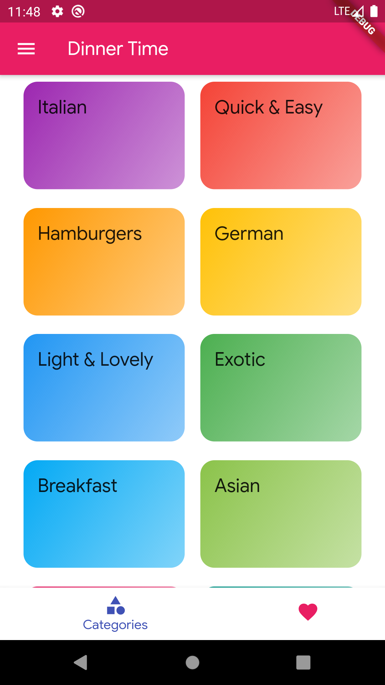
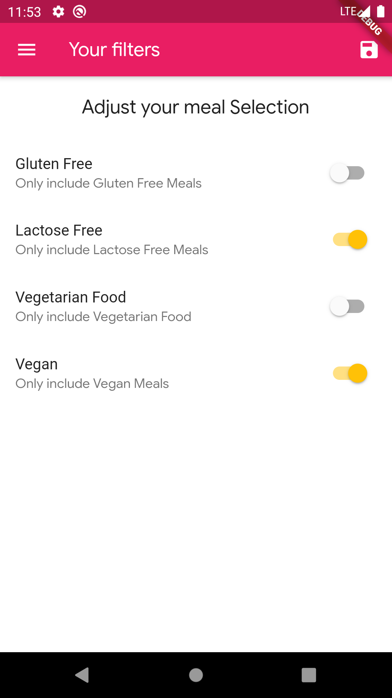
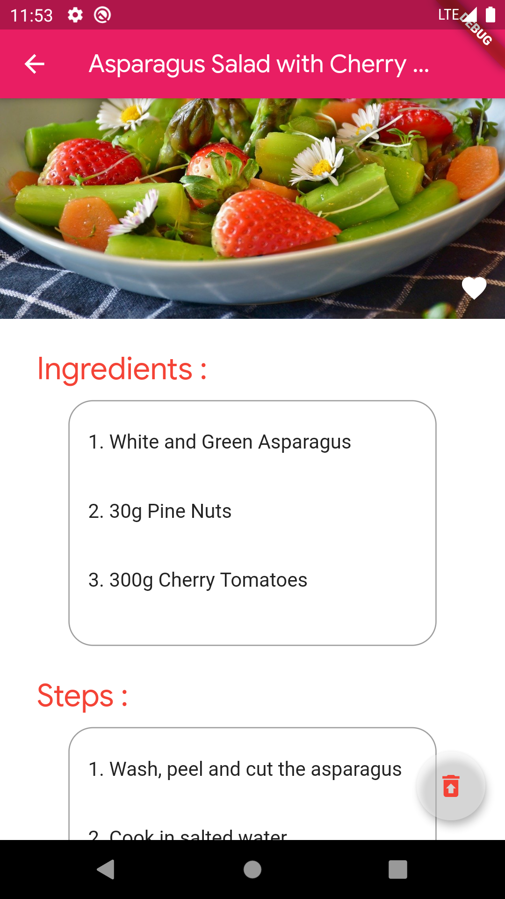
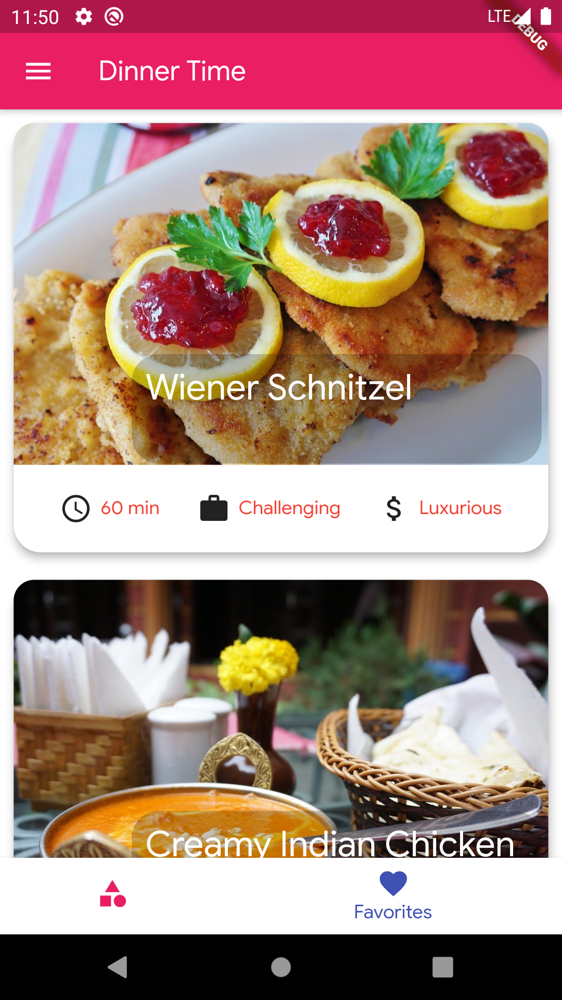

# Dinner Time

Meals app with category, filters, Favourites, recipes!

## Screenshots

### Filtered Result Screen
 

### Category Screen
 

### Drawer

### Filters
  

### Recipe Screen

### Favourite Screen

## Features 
1. Filter Your Meals Accordingly
2. Grid View Depending on Categories
3. Mark as Favourite 
4. Detailed Recipe with Ingredients

## Contributing
Pull requests are welcome. For major changes, please open an issue first to discuss what you would like to change.

Please make sure to update tests as appropriate.
